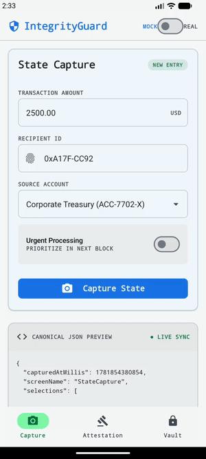
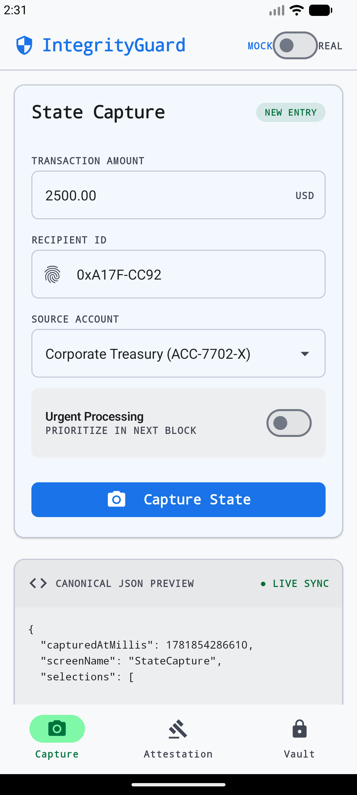
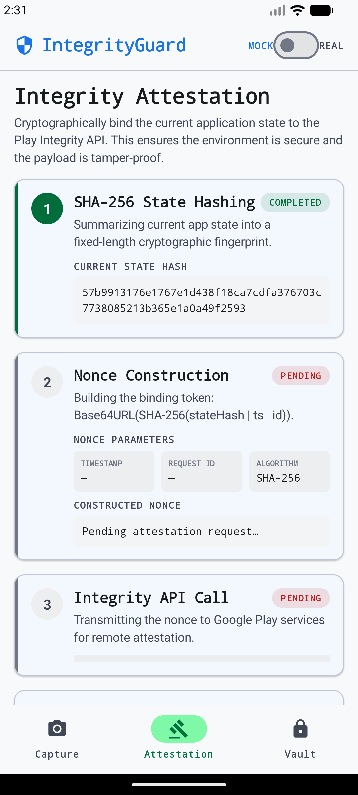
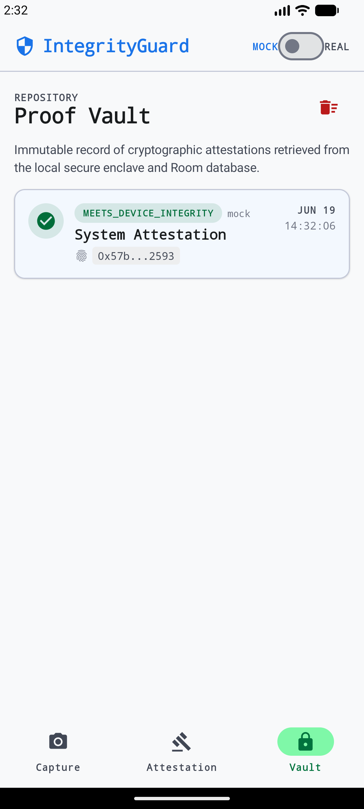
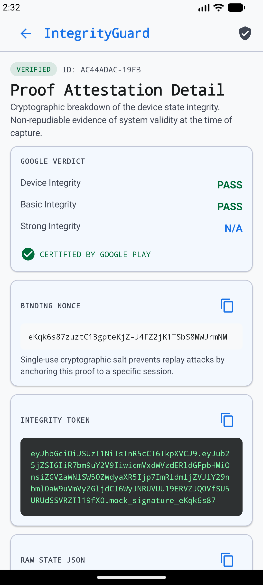

# android-play-integrity

Android proof-of-concept demonstrating cryptographic binding of app screen state to **Google Play Integrity** attestation, built with **Kotlin**, **Jetpack Compose**, **Material3**, **Room**, and **MVVM + StateFlow**. A nonce is constructed from a SHA-256 hash of the current UI state, an ISO 8601 timestamp, and a UUID request ID, so every integrity token is provably tied to the exact screen the user saw at that moment - no screenshots required.

The UI follows the **IntegrityGuard / Nexus Trust System** design language: a light, "glass-box" technical aesthetic with Security Blue + Integrity Green accents, monospace cryptographic data, and a three-tab flow - **Capture -> Attestation -> Vault** - plus a Proof Detail breakdown.

## Demo

Mock mode works out of the box with no Google Play Console setup.



## Screenshots

| State Capture | Attestation Flow | Proof Vault | Proof Detail |
|---------------|------------------|-------------|--------------|
|  |  |  |  |

## Features

- **State Capture** screen: capture a transaction form (amount, recipient, source account, urgent flag) as deterministic, sorted-key canonical JSON, rendered live in a "Canonical JSON Preview" pane with a running state hash
- Compute SHA-256 of the canonical JSON to produce a `stateHash`
- **Attestation Flow** screen: a vertical stepper (SHA-256 hashing -> nonce construction -> Integrity API call) that builds the nonce `Base64URL(SHA-256(stateHash | timestamp | requestId))` and requests a token
- Request a Play Integrity token with that nonce (mock or real, toggled from the top-bar Mock/Real switch)
- Parse and display the full JSON verdict returned by Google
- Persist every proof in a local Room database (`integrity_proofs.db`)
- **Proof Vault** screen: browse stored proofs with status chips (verified / pending / untrusted), tap any entry for the full breakdown, copy any field to clipboard
- **Proof Detail** screen: Google verdict, binding nonce, full integrity token, raw state JSON, health assessment
- Clear the full vault with one tap

## Stack

- **Kotlin** + **Jetpack Compose** + **Material3** - UI layer
- **Google Play Integrity API 1.3.0** - device/app attestation
- **Room 2.6.1** - local SQLite persistence of proof records
- **Navigation Compose 2.7.6** - bottom-nav tab flow (Capture / Attestation / Vault) with a Proof Detail overlay
- **Gson 2.10.1** - canonical JSON serialization with `TreeMap` for deterministic key order
- **MVVM + StateFlow** - `AndroidViewModel` exposes `HomeUiState` / vault list as cold flows; capture and attestation share one `HomeViewModel`
- **KSP** - annotation processing for Room DAO generation
- **JUnit 4** - unit tests for `CryptoService` and `StateCapture`

## Architecture

```
app/src/main/java/com/hautt/playintegrity/
├── MainActivity.kt              # Scaffold + bottom-nav tabs (Capture/Attestation/Vault) + Detail overlay
├── model/
│   ├── AppStateSnapshot.kt      # Screen state data class (screenName, visibleFields, selections)
│   ├── IntegrityProof.kt        # Room entity (@Entity integrity_proofs)
│   ├── ProofDao.kt              # DAO: getAllProofs() Flow, getProofById(), insertProof(), deleteAll()
│   └── ProofDatabase.kt         # Room singleton database
├── service/
│   ├── CryptoService.kt         # sha256Hex(), buildNonce(), generateRequestId()
│   ├── StateCapture.kt          # capture() -> (AppStateSnapshot, canonicalJson)
│   ├── IntegrityService.kt      # IntegrityService interface + IntegrityResult data class
│   ├── PlayIntegrityService.kt  # Real Play Integrity API (requires Play Console)
│   └── MockIntegrityService.kt  # Simulated responses for demo (no Play Console needed)
└── ui/
    ├── home/                    # CaptureScreen + HomeViewModel (live state capture + attestation logic)
    ├── attestation/             # AttestationScreen (SHA-256 -> nonce -> API stepper)
    ├── history/                 # HistoryScreen (Proof Vault) + HistoryViewModel
    ├── detail/                  # ProofDetailScreen (full proof with copy-to-clipboard)
    ├── components/              # IntegrityComponents.kt (top bar, cards, status chips, mono blocks)
    └── theme/                   # Nexus Trust System light Material3 theme
```

```mermaid
flowchart TD
    A[CaptureScreen\namount + recipient + source + urgent] -->|live recompute| B[HomeViewModel]
    B --> C[StateCapture.capture\nscreenName + fields + selections]
    C --> D[canonical JSON\nsorted keys via TreeMap]
    D --> E[CryptoService.sha256Hex\nstateHash - shown live]
    A -->|Capture State| AT[AttestationScreen\nSHA-256 -> nonce -> API stepper]
    AT -->|requestAttestation| F[CryptoService.buildNonce\nBase64URL SHA-256 of stateHash|timestamp|requestId]
    E --> F
    F --> G{useMock?}
    G -->|true| H[MockIntegrityService\n500 ms simulated delay\nreturns fake JWT + verdict JSON]
    G -->|false| I[PlayIntegrityService\nIntegrityManagerFactory\nrequires Play Console + signed APK]
    H --> J[IntegrityResult\ntoken + verdict + isSuccess]
    I --> J
    J --> K[IntegrityProof\nRoom entity]
    K --> L[ProofDao.insertProof\nRoom SQLite]
    L --> N[HistoryScreen - Proof Vault\nProofDao.getAllProofs Flow]
    N --> O[Proof card\nstatus chip + truncated hash + date]
    O -->|tap| P[ProofDetailScreen\nverdict + nonce + token + raw JSON + copy]
```

## Mock data

The app ships a `MockIntegrityService` (`service/MockIntegrityService.kt`) that replaces the real Play Integrity API call entirely - no Google Cloud project or Play Console configuration is needed to run the demo.

When `useMock = true` (the default, set via `BuildConfig.USE_MOCK_INTEGRITY = true` in `app/build.gradle.kts`):

- Simulates 500 ms network latency via `kotlinx.coroutines.delay(500)`
- Returns a fake JWT-shaped integrity token with the first 8 characters of the real nonce embedded in the signature segment, making it visually identifiable per request
- Returns a hardcoded JSON verdict with all three verdicts set to their passing values:
  - `appIntegrity.appRecognitionVerdict`: `"PLAY_RECOGNIZED"`
  - `deviceIntegrity.deviceRecognitionVerdict`: `["MEETS_DEVICE_INTEGRITY"]`
  - `accountDetails.appLicensingVerdict`: `"LICENSED"`
- The `requestDetails` block uses the real nonce and `System.currentTimeMillis()` so each proof record has a unique, realistic timestamp

The initial `HomeUiState` pre-fills the capture form (amount `2500.00`, recipient `0xA17F-CC92`, source `ACC-7702-X`), so a first-time user can tap "Capture State", then "Request Attestation", immediately without typing anything.

## Run

### Mock mode (default, no setup required)

```bash
# Clone and open in Android Studio, or build from CLI:
./gradlew assembleDebug
# Install on a connected device or emulator (API 26+):
adb install app/build/outputs/apk/debug/app-debug.apk
```

### Real Play Integrity mode

1. Set up a Google Cloud project and enable the Play Integrity API
2. Link the Cloud project to your Play Console app (App integrity -> Link Cloud project)
3. In `app/build.gradle.kts`, update the two `buildConfigField` lines:
   ```kotlin
   buildConfigField("Boolean", "USE_MOCK_INTEGRITY", "false")
   buildConfigField("Long", "CLOUD_PROJECT_NUMBER", "<your_cloud_project_number>L")
   ```
4. Build a signed APK or AAB and publish to an internal testing track in Play Console
5. Install via Play Console internal testing on a real device with Google Play Services

### Unit tests

```bash
./gradlew test
```

Tests cover `CryptoService` (SHA-256 known values, nonce determinism, Base64URL alphabet, UUID format/uniqueness) and `StateCapture` (canonical JSON key ordering).
